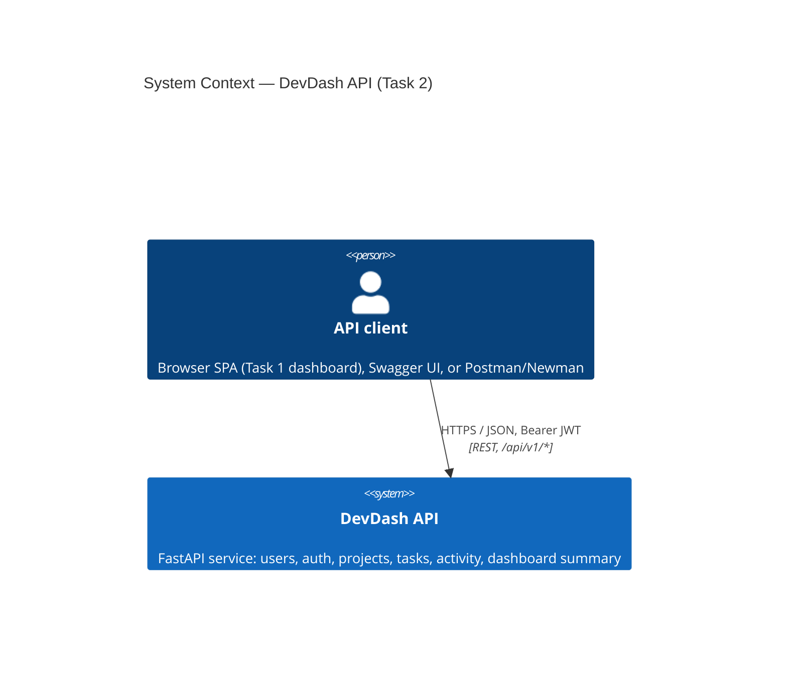
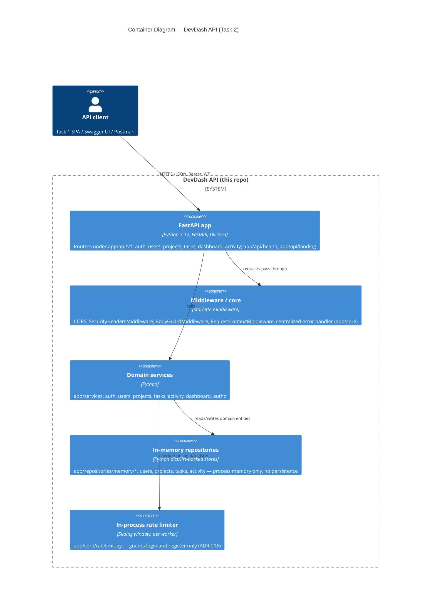

# Architecture (C4: Context + Container)

This is based on the real code structure of this repo (`app/`), not on assumed
frameworks. Task 2 is a FastAPI service that keeps all state **in memory**
(`app/repositories/memory/*`) — there is no database in this repo (Task 3 adds
PostgreSQL, in a separate repo). There is no AI/LLM provider or outbound
third-party HTTP client anywhere in `app/` (verified by grep for
`openai|anthropic|httpx|requests\.|aiohttp|llm|gpt` across `app/`, zero hits).

## C4 Level 1 — System Context

No external system boxes are drawn beyond the client, because this repo has no
outbound dependency: no database, no email/notification provider, no AI
provider, no third-party API calls. State lives entirely inside the process
and is lost on restart (see `app/main.py` docstring: "State is kept in memory
and resets on restart").

## C4 Level 2 — Containers

## Notes

- **No database in this repo.** `app/repositories/memory/` is the entire
  persistence layer; all data is lost on process restart. PostgreSQL
  persistence is implemented in the separate Task 3 repository.
- **No AI/LLM provider.** Verified by grepping `app/` for AI/LLM/HTTP-client
  identifiers; no matches.
- **Auth**: JWT (HS256) issued by `app/core/security.py`, verified per
  request via `app/api/deps.py`. Passwords hashed with argon2id.
- Diagram source follows the [C4 model](https://c4model.com/) using the
  Mermaid `C4Context`/`C4Container` syntax.
